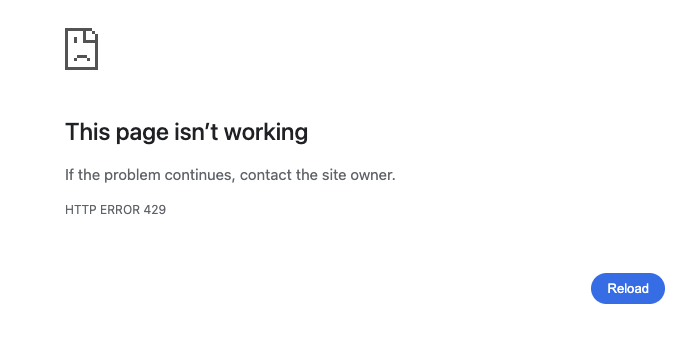
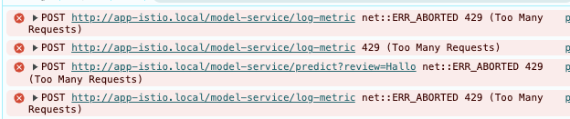

# 🛠️ REMLA Project – Operation Repository

This repository contains the setup and operational instructions for running the Restaurant Sentiment Analysis system, supporting both Docker Compose (Assignment 1) and Kubernetes cluster (Assignment 2) deployments.

## 📦 System Overview

This system is structured according to the REMLA reference architecture and consists of two core services:

- `app`: The frontend/backend web application that interacts with users and forwards requests to the model service.
- `model-service`: A REST API wrapper around the trained machine learning model.

Both services are containerized and can be deployed via Docker Compose (local) or Kubernetes (production-grade), using pre-built images hosted on GitHub Container Registry (GHCR).

## 🐳 Running the Application

### Assignment 1 – Docker Compose (Local)

Run the system locally using Docker Compose.

1. **Prerequisites**:
   - Docker and Docker Compose installed.
   - Access to GitHub Container Registry (GHCR).
2. **Login to GHCR** (if images are private):
   ```bash
   echo <YOUR_GH_TOKEN> | docker login ghcr.io -u <YOUR_GITHUB_USERNAME> --password-stdin
   ```
3. **Define the .env file**
   - Docker pulls the app and model-service versions defined through environment variables from the .env file.
   - Since, .env is not part of the repo, you need to manually create it the root directory of the project
   - Below is an example of a valid .env:
   
   APP_VERSION=0.4.1
   APP_PORT=3000
   MODEL_SERVICE_VERSION=0.1.6
4. **Start the system**:
   ```bash
   docker-compose up
   ```
   - Access the application at: `http://localhost:3000`

### Assignment 2 – Kubernetes Cluster (Production)

Provision a Kubernetes cluster with Istio service mesh to deploy the system in a production-grade environment.

1. **Prerequisites**:
   - Vagrant and VirtualBox installed.
   - Ansible installed for provisioning.
2. **Place your public key in keys folder**
   ```bash
   # Command is ran from the 'operation' repository
   cp ~/.ssh/id_ed25519.pub ./ansible/keys/<your_name>.pub
   ```
3. **Provision virtual machines**:
   ```bash
   vagrant up
   ```
   - Creates controller (`ctrl`, 1 CPU, 4GB) and worker nodes (`node-<N>`, 2 CPUs, 6GB) using `bento/ubuntu-24.04`.
4. **Run final provisioning**:
   ```bash
   ansible-playbook -u vagrant -i 192.168.56.100, ansible/finalization.yml
   ```
   - Installs MetalLB, Nginx Ingress, Kubernetes Dashboard, and Istio 1.25.2.
5. **Istio Service Mesh**:
   - Lightweight Istio 1.25.2 installed via Ansible using `istioctl`.
   - Istio Ingress Gateway exposed on `192.168.56.91` via MetalLB.

**Operation Release**: [A2 Release](https://github.com/remla25-team20/operation/releases/tag/a2)

### Assignment 3 - Operate and Monitor Kubernetes

Deploying our own application to kubernetes and monitoring

1. **Prerequisites**

   - Have a kubernetes cluster running as in Assignment 2 _or_ have a local minikube cluster running

2. **Install application via Helm chart**

   ```bash
   # This command requires you to run from the `operation` repository
   # KUBECONFIG is only necessary if you haven\'t added it to your global config
   KUBECONFIG=kubeconfig helm install app ./app-chart/
   ```

   
3. **Application connect**

   The application (and its dashboards) are reachable once the four host-names below resolve to the MetalLB IP **192.168.56.90**:

   | Component | Host-name |
   |-----------|-----------|
   | Front-end / API | `app.local` |
   | Grafana | `grafana.app.local` |
   | Prometheus | `prometheus.app.local` |
   | Mailpit | `mailpit.app.local` |

   **Quick option A – one-liner script (recommended)**

   ```bash
   # From the repo root
   chmod +x ./scripts/add_ingress_hosts.sh     # make it executable – run once
   sudo ./scripts/add_ingress_hosts.sh [IP] [IP_ISTIO]  # If no IP is given, default to 192.168.56.90 - IP_ISTIO defaults to an increment of IP.
   # writes/updates the hosts block
   ```
   The script is **idempotent**: It will clean itself upon re-run.
   ⚠️  _this script does **not** alter existing host entries with identical names!_

   **Option B – manual edit**
      Added the following to your `/etc/hosts`.
   ```bash
      192.168.56.90 app.local grafana.app.local prometheus.app.local mailpit.app.local
   ```
   - (OPTIONAL) need a flush of DNS cache as in assignment 2:
   ```bash
   sudo dscacheutil -flushcache; sudo killall -HUP mDNSResponder # MacOS
   sudo systemd-resolve --flush-caches # Linux/systemd
   ipconfig /flushdns # Windows
   ```
   - (POSSIBLE PROBLEM) The ingress-nginx-controller should have external IP 192.168.56.90 by default, but if it is not working please check on which IP the ingress-nginx-controller is exposed with the following command and edit your `/etc/hosts` accordingly.
   ```bash
   # Again KUBECONFIG only needed if you haven\'t added it to your global config
   KUBECONFIG=kubeconfig kubectl get svc -n ingress-nginx
   ```

4. **Monitoring and Alerting**

   **Monitoring** (Prometheus Operator + Grafana) is installed automatically via the Ansible finalization step.  

   Before accessing monitoring dashboards, add these entries to your `/etc/hosts` file (alongside `app.local`):

   ```bash
   192.168.56.90 grafana.app.local
   192.168.56.90 prometheus.app.local
   192.168.56.90 mailpit.app.local
   ```

   **Alerting**manager needs a Secret in the monitoring namespace to be able to initialize.

   Create `alertmanager-secret.yaml`
   ```yaml
   apiVersion: v1
   kind: Secret
   metadata:
      name: alertmanager-email-secret
      namespace: monitoring
   type: Opaque
   stringData:
      smtpPassword: "<YOUR_SMTP_PASSWORD>" # not really need to be real one, as we use Mailbit
   ```

   We include a built-in synthetic alert to verify end-to-end email routing via Mailpit. To toggle it, add to your `values.yaml`:

   ```yaml
   testEmail:
     enabled: true   # set to false to disable the TestEmail rule
   ```  
   ##### Alerting Rules for Excellence
   We include two production-grade alert rules to monitor `model-service`
   - **TooManySubmit**: fires if the there is more than 5 submits within the 30s interval.This is easy to trigger and thus (serverity: warning).
   - **HighModelErrorRate**: fires if the prediction error rate exceeds 10 % over a 5-minute window (severity: critical).

   All alert notifications (including the synthetic TestEmail alert) are routed to Mailpit rather than real email addresses. You can view them in the Mailpit UI at <http://mailpit.app.local>.


5. **View & configure monitoring dashboards**
   Once the `monitoring` Helm release is **`STATUS: deployed`** it can take 15-30 s before Prometheus finishes its first scrape of *model-service*.  
   During that time Grafana panels may still read “No data” – just refresh once the target turns **UP** (Prometheus → *Status ▸ Targets*).
   **Log in to Grafana**
   | URL | Default user | Default password |
   |-----|--------------|------------------|
   | <http://grafana.app.local> | `admin` | `prom-operator` |

   
   The dashboard is automatically installed into grafana under the name **Model Dashboard**

   ```
   The dashboard shows:

   | Panel        | Metric                                                                                                          | Prometheus type |
   |--------------|-----------------------------------------------------------------------------------------------------------------|-----------------|
   | CPU Usage    | `sum(model_cpu_percent)`                                                                                        | Gauge           |
   | Memory RSS   | `sum(model_memory_rss_bytes)`                                                                                   | Gauge           |
   | p95 Latency  | `histogram_quantile(0.95, sum by(le, model_service_version)(rate(request_latency_seconds_bucket[5m])))`         | Histogram       |
   | Success /s   | `sum by(model_service_version)(rate(prediction_success_total[1m]))`                                             | Counter         |
   | Error /s     | `sum by(model_service_version)(rate(prediction_error_total[1m]))`                                               | Counter         |


## Rate Limiting

   To protect the application from abuse and ensure high availability, a rate-limiting mechanism has been implemented at the gateway level. This feature is enabled by default.

   - **Default Limit**: By default, each client (identified by their IP address) is allowed **200 requests per minute**.
   - **Error Code**: If a client exceeds this limit, they will receive an `HTTP 429 Too Many Requests` error response.
   
   
### Adjusting for Testing

   For development or testing purposes, you may want to use a lower rate limit to verify that the functionality is working correctly. You can adjust this value in the `app-chart/templates/rate-limit.yaml` file.

   By modifying the `requests_per_unit`

<pre>
  <code class="language-yaml" data-source-line="176">
   rate_limit:
   unit: minute
   requests_per_unit: 200
  </code>
</pre>


### Quick links

| Component | URL | Default credentials |
|-----------|-----|---------------------|
| **Grafana** | <http://grafana.app.local> | `admin / prom-operator` |
| **Prometheus** | <http://prometheus.app.local> | – |
| **Mailpit** | <http://mailpit.app.local> | - |
| **Front-end** | <http://app.local> | – |

## 🧭 Repository Overview

| Component            | Description                                           |
| -------------------- | ----------------------------------------------------- |
| `docker-compose.yml` | Defines services for local Docker Compose deployment. |
| `Vagrantfile`        | Configures Kubernetes cluster VMs for Assignment 2.   |
| `ansible/`           | Contains Ansible playbooks for cluster provisioning.  |
| `README.md`          | Instructions to operate the system (this file).       |

## 🔗 Project Repositories

This organization is structured into multiple public repositories:

- [model-training](https://github.com/remla25-team20/model-training)
- [model-service](https://github.com/remla25-team20/model-service)
- [lib-ml](https://github.com/remla25-team20/lib-ml)
- [lib-version](https://github.com/remla25-team20/lib-version)
- [app](https://github.com/remla25-team20/app)
- [operation](https://github.com/remla25-team20/operation) ← you are here

## 📈 Assignment Progress Log

### Assignment 1 – Versions, Releases, and Containerization

- ✅ **Set up system architecture**: Established organization repositories for REMLA components.
- ✅ **Released Python packages**: Published `lib-ml` and `lib-version` to PyPI.
- ✅ **Built Docker images**: Created and pushed `model-service` and `app` images to GHCR.
- ✅ **Configured Docker Compose**: Defined `docker-compose.yml` for local deployment.
- ✅ **Added image metadata**: Included description metadata in container images.
- ✅ **Verified multi-architecture support**: Ensured images support amd64 and arm64.

### Assignment 2 – Provisioning a Kubernetes Cluster

#### Targeted Rating

| Category                            | Rating        | Notes                                                                  |
| ----------------------------------- | ------------- | ---------------------------------------------------------------------- |
| Setting up (Virtual) Infrastructure | **Excellent** | Fully automated VM setup with configurable worker nodes and inventory. |
| Setting up Software Environment     | **Good**      | Errors in first run of `finalization.yml`; works on second run.        |
| Setting up Kubernetes               | **Good**      | Missing HTTPS Ingress Controller with self-signed certificates.        |

- ✅ **Automated virtual infrastructure**: Set up configurable VMs (`ctrl`, `node-<N>`) with Vagrant and Ansible inventory.
- ✅ **Deployed Kubernetes cluster**: Initialized cluster with `kubeadm`, `kubectl`, Flannel, and Helm.
- ✅ **Installed production components**: Configured MetalLB, Nginx Ingress, and Kubernetes Dashboard.
- ✅ **Enabled Istio service mesh**: Deployed Istio 1.25.2 with Ingress Gateway on `192.168.56.91`.

### Assignment 3 – Operate and Monitor Kubernetes

#### Targeted Rating

| Category            | Rating     | Notes                                                                                          |
|---------------------|------------|------------------------------------------------------------------------------------------------|
| Kubernetes Usage    | **Good**   | Dedicated `app` namespace created via `--create-namespace`; Helm values parametrize image, port, etc. |
| Helm Installation   | **Good**   | `helm upgrade --install`, separate `monitoring` release, configurable `ServiceMonitor` label.  |
| App Monitoring      | **Good**   | Five custom metrics: 3 × Counter, 2 × Gauge, 1 × Histogram; exposed via `ServiceMonitor`.      |
| Grafana Dashboard   | **Excellent** | Five-panel dashboard automatically installed as Model Dashboard.   |

- ✅ **Converted app deployment to Helm chart**: Parameterized model service port, service names, and image versions.
- ✅ **Deployed application via Helm**: Application and model-service deployed using Helm on self-provisioned Kubernetes cluster.
- ✅ **Ingress exposure via Nginx**: App reachable at `http://app.local` through `ingress-nginx-controller` with MetalLB IP.
- ✅ **Prometheus integration with ServiceMonitor**: Automatically scrapes `/metrics` endpoint from model-service.
- ✅ **Custom application metrics**: Three metrics (Gauge, Counter, Histogram) defined in the app and collected.
- ✅ **Grafana dashboard setup**: Manually imported JSON dashboard visualizes metrics using counters, gauges, and histogram functions.
- 🛠 **Working on alerting**: Preparing PrometheusRule and AlertManager integration to support automatic notifications.


### Assignment 4 – ML Configuration Management & ML Testing

#### Targeted Rating
| Category            | Rating     | Notes                                                                                          |
|---------------------|------------|------------------------------------------------------------------------------------------------|
| Automated Tests    | **Poor/Sufficient**   | Automated tests included, following ML Test Score methodology but not yet covering sufficient categories. Coverage is already automatically measured. |
| Continuous Training   | **Excellent**   | Workflows in model-training automatically conduct tests and generate badges. |
| Project Organization      | **Excellent**   |   All elements achieved.   |
| Pipeline Management with DVC | **Excellent** | DVC pipeline is setup with Google Drive |
| Code Quality   | **Excellent** | PyLint and Flake8 are configured with a custom rule for detecting hard-coded variables.   |

Please note regarding the Automated Tests: a framework for monitoring the performance of the word encoder over time was implemented (Prometheus data endpoints were configured). However, due to lack of time, no visualization was attempted.

The objective was to send out an alert when $`\frac{word\_count\_encoded}{word\_count\_raw} \leq 0.75`$. This test would have asserted the efficacy of the trained encoder on real-world data. 

### Assignment 5 - Istio Service Mesh

#### Targeted Rating
| Category            | Rating     | Notes                                                                                          |
|---------------------|------------|------------------------------------------------------------------------------------------------|
| Traffic Management  | **Excellent**   | Version-Consistent 90/10 routing, Sticky Sessions implemented   |
| Additional Use Case   | **Sufficient**   | Baseline rate limiting implemented but issues still persist. |
| Continuous Experimentation     | **Good**   |   Button color experiment is implemented and relevant metrics are measured.  |
| Deployment Documentation | **Good / Excellent** | Deployment.md made to the best of current insight. |
| Extension Proposal   | **Insufficient** | Not implemented for this deadline due to time constraints.   |
