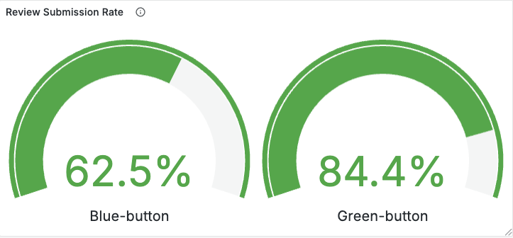

# Continuous Experimentation: Button Color Change Experiment

## Description of the Change

In this experiment, we modified the UI of the review submission feature. Specifically, we changed the color of the "Analyze Text" button from **blue** (original version) to **green** (new version). All other design and functionality aspects remain unchanged.

## Hypothesis

> Changing the "Analyze Text" button color to green will increase the percentage of users who submit a review.

This is based on the assumption that green, being associated with action and positivity, encourages more user interaction compared to blue.

## Metrics

To evaluate the hypothesis, we collect the following app-specific metrics (exported via Prometheus and visualized in Grafana):

- `reviews_started_total`: Counter – number of users who start typing in the review input field.
- `reviews_submitted_total`: Counter – number of users who click the "Analyze Text" button to submit a review.

These metrics are tagged by service version (`version=button-blue`, `version=button-green`) to allow direct comparison. The submission rate will be computed directly in Grafana as the ratio between submitted and started counts.

## Deployment Setup

Two versions of the review service are deployed:

- **v1**: Original version with a blue button.
- **v2**: Experimental version with a green button.

Both services are exposed to users in an A/B testing setup (e.g., 50/50 traffic split).

## Decision Process

A Grafana dashboard displays:

- Line charts of `reviews_started_total` and `reviews_submitted_total` over time for both versions.
- A calculated submission rate per version derived from these two metrics.

**Decision Criteria:**

- If the green version (`v2`) consistently shows a **higher submission rate** over a statistically significant number of sessions (e.g., >500 interactions per version) and across a sustained time window (e.g., 48 hours), we will adopt the green button as the new default.
- If no significant difference is observed, or the blue version performs better, we will retain the original design.

## Visualization

