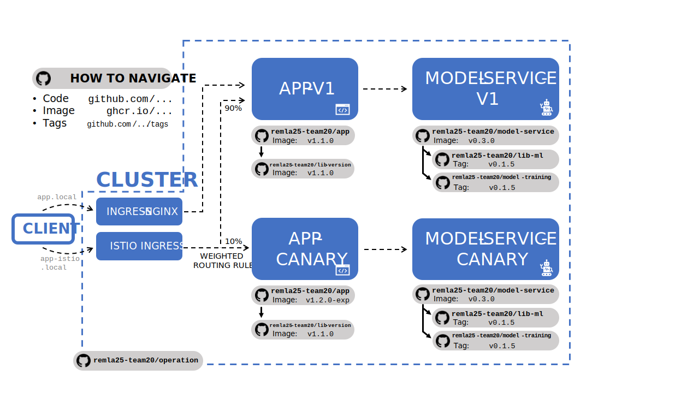

# Deployment Documentation
This document aims to offer a high-level overview of the REMLA project by group 25.

_Diagram of the deployment structure of the project. Dashed arrows indicate data flow, solid arrows indicate dependencies._

An ISTIO service mesh is deployed to facilitate a canary deployment. Users are randomly assigned to either the most current release (`-V1`) or a canary release (`-CANARY`) at a ratio of 9:1 respectively. Configuration of this deployment is done through Helm chart files found under the `app-chart`folder. 

As part of this project's prior phases, an `NGINX` ingress is still available, which will exclusively route to the most current release.
**Please Note:** support for the `NGINX` ingress is not guaranteed to persist. If you wish to conduct tests without the canary release, please adjust the weights in the file `/app-chart/templates/istio.yaml`.

## Chart Files
The following is an overview of the files present in the `app-chart`.
### `Chart.yml`
This contains the basic application data.
### `Values.yml`
This contains a list of configurable values. Adjust only as needed.
**Note:** To adjust the releases selected for model-service and app, adjust the version numbers for `modelService->version` and `app->version`. To change the canary version, simply change `versionCanary` instead.
### `templates/config-map.yaml`
A configuration file. Currently only stores the model-service port.
### `templates/deployment.yaml`
File containing specifications for Deployments corresponding to the configured versions. Currently set-up to create three parallel deployments for each image (`app`, `app-canary`, `model-service`, `model-service-canary`).
### `templates/istio.yaml`
This file specifies the Istio gateway as well as the routing infrastructure components needed for Istio (VirtualService, DestinationRule) to route traffic to either `APP-V1` or `APP-CANARY`, and maintain alignment between `APP` and `MODEL-SERVICE`.
### `templates/model-service-monitor.yaml`
This file contains the specifications for a ServiceMonitor; namely, the specifications Prometheus needs to fetch metrics from `model-service`.
### `templates/secrets.yaml`
This is a dummy file containing a dummy secret. A rework of secret implementation is still pending.